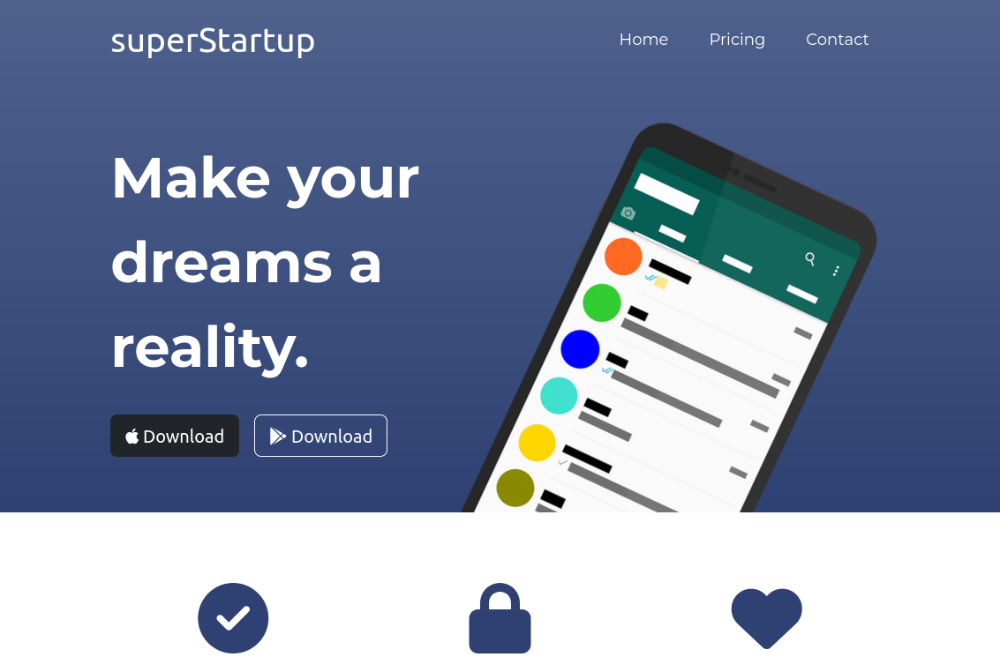
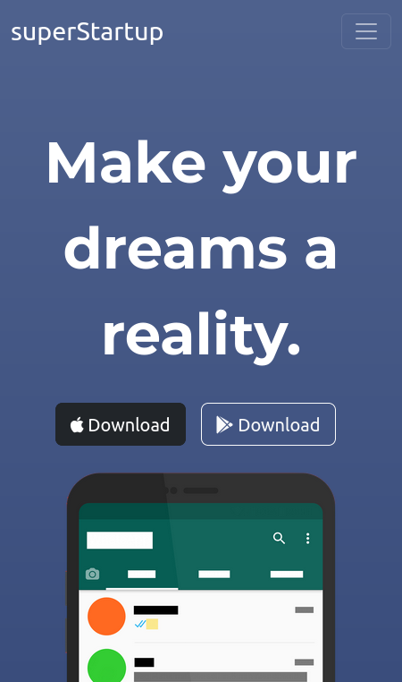

# Frontend Developer Portfolio - Basic Startup Landing Page Template

## Table of contents

- [Overview](#overview)
  - [Screenshot](#screenshot)
  - [Links](#links)
- [My process](#my-process)
  - [Built with](#built-with)
  - [What I learned](#what-i-learned)
  - [Continued development](#next-goals)
- [Author](#author)
- [Acknowledgments](#acknowledgments)

### Screenshot

### Links

- Live Site URL: [Add live site URL here](https://your-live-site-url.com)

## My process
This project was created for an assignment from my frontend development class. The goal was to create a basic landing page for a generic startup company using the Bootstrap framework.

### Built with

- css
- html
- Bootstrap framwork

### What I learned
- Structure a basic landing page using Bootstrap
- Implement basic responsive CSS features

### Next Goals
- Complete case studies on color usage to improve implementation of UI best practices.
- Continue to study UX design to provide the best user experience

## Author

- Website - [Nick](https://harmonia.codes)

## Acknowledgments

Thank you to Angela Yu for hosting this challenge via your dev course.
